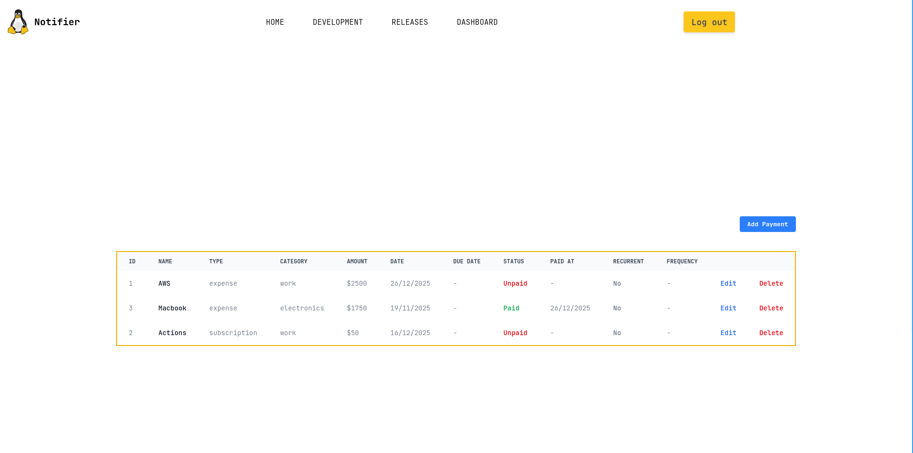

<h1 align="center">
    
</h1>

<h1 align="center">
  <a href="#"> Notifier </a>
</h1>

<p align="center">
  
  <a href="https://github.com/rober0xf/notifier-front">
    
  </a>
    
  
  <a href="https://github.com/rober0xf/">
    
  </a>
</p>

<h4 align="center">Status: Finished</h4>

<p align="center">
 <a href="#about">About</a> •
 <a href="#features">Features</a> •
 <a href="#how-it-works">How it works</a> • 
 <a href="#tech-stack">Tech Stack</a> •  
 <a href="#author">Author</a> • 
 <a href="#user-content-license">License</a>
</p>

## About

Frontend for the payment notification system

---

## Features

- [x] Users will be able to access via login and register
- [x] Users will be able to manage payments:
  - [x] add payments
  - [x] see payments
  - [x] update payments
  - [x] delete payments

---

## How it works

The project is divided into two parts:

1. Backend (another repo)
2. Frontend (this repo)

But this repository is referring only to the Frontend part. Frontend need the Backend to be running to work.

### Pre-requisites

Before you begin, you will need to have the following tools installed on your machine:
[Git](https://git-scm.com), [Bun](https://bun.com/).
In addition, it is good to have an editor to work with the code like [Neovim](https://neovim.io/)

#### Running the web application (Frontend)

```bash
# Clone this repository
$ git clone https://github.com/rober0xf/notifier-front.git

# Access the project folder in your terminal
$ cd notifier-front

# Install the dependencies
$ bun install

# Run the application in development mode
$ bun run dev

# The application will open on the port: 5173 - go to http://localhost:5173

```

---

## Tech Stack

The following tools were used in the construction of the project:

#### **Platform** ([React](https://reactjs.org/) + [TypeScript](https://www.typescriptlang.org/))

- **[React Router Dom](https://reactrouter.com/)**
- **[TailwindCSS](https://tailwindcss.com/)**
- **[Prime Icons](https://www.npmjs.com/package/primeicons)**
- **[Zustand](https://zustand.docs.pmnd.rs)**

> See the file [package.json](https://github.com/rober0xf/notifier-front/blob/master/package.json)

---

## Author

[](https://www.linkedin.com/in/rober0xf/)

---

## License

This project is under the license [MIT](./LICENSE).
